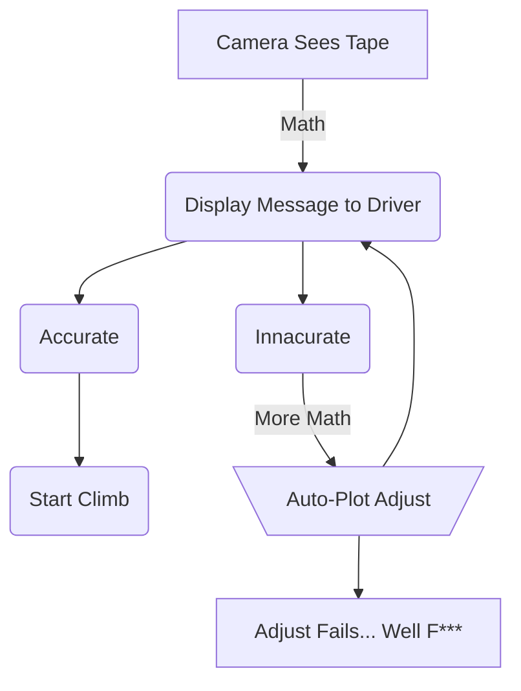
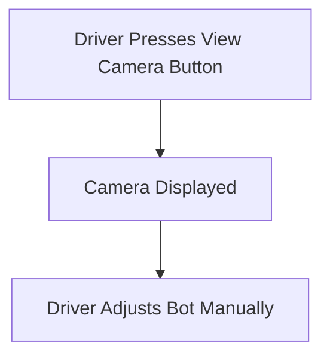
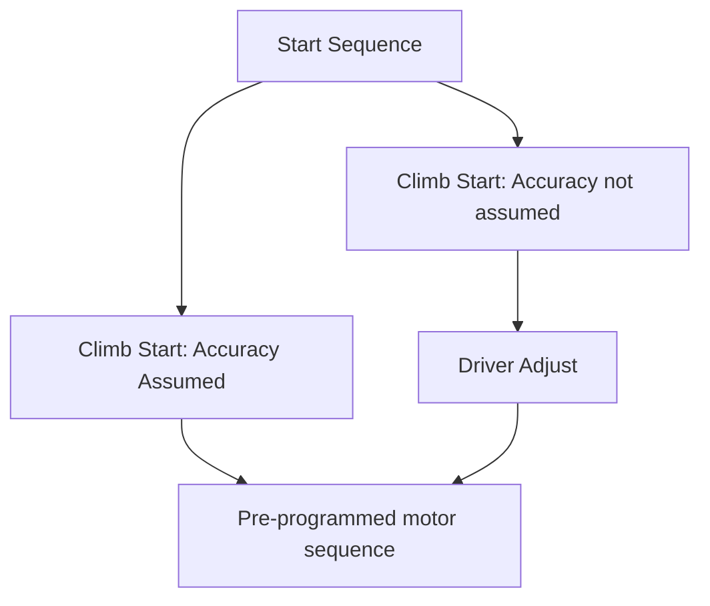
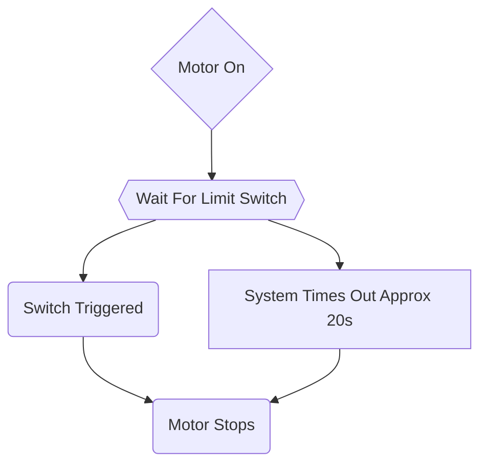
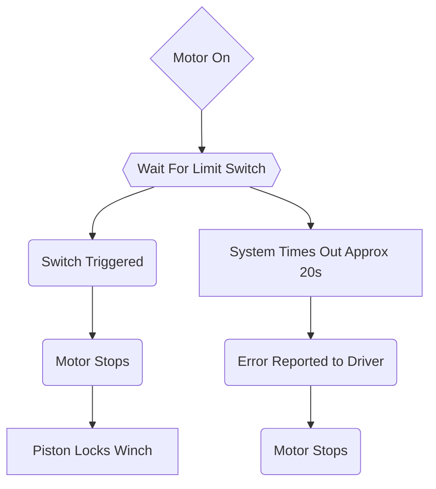

# Climber

## Detection Sequence

### Automated Sequence

**STATUS:** Not Started

### Manual Sequence

**STATUS:** Not Started

## Climb Sequence

### Start Sequence
**STATUS:** Not Started

### Motor Sequence (No Winch)
**STATUS:** Not Started

### Motor Sequence (With Winch)

